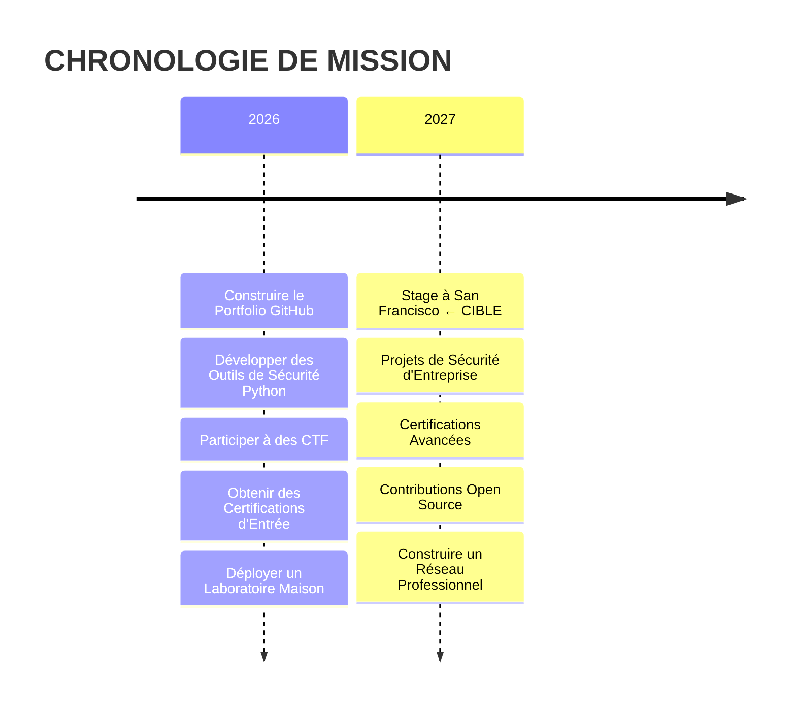

<!--
  ⚡ REMPLACER "MY_GITHUB_USERNAME" par votre nom d'utilisateur GitHub partout ci-dessous
  Rechercher : MY_GITHUB_USERNAME
  Remplacer par : votre-username
-->

<div align="center">
  

   _____      _           _       _     ____       _   
  / ____|    | |         | |     | |   / __ \     | |  
 | |     ___ | |__   ___ | |_ ___| |  | |  | | ___| |_ 
 | |    / _ \| '_ \ / _ \| __/ _ \ |  | |  | |/ __| __|
 | |___| (_) | |_) | (_) | ||  __/ |  | |__| | (__| |_ 
  \_____\___/|_.__/ \___/ \__\___|_|   \____/ \___|\__|


</div>

<div align="center">
  
  

  <br/>
  
  [](https://github.com/MY_GITHUB_USERNAME)
  
  <br/>
  
  
  
</div>

<br/>

---

<div align="center">

## ⚡ SÉQUENCE DE DÉMARRAGE

</div>

<div align="center">

```console
root@cobalt-os:~$ ./init_system.sh

[████████████████████████] 100%   Modules du noyau chargés
[████████████████████████] 100%   Vérification mémoire : OK
[████████████████████████] 100%   Règles du pare-feu appliquées
[████████████████████████] 100%   Capteurs IDS actifs
[████████████████████████] 100%   Volumes chiffrés montés

STATUT : TOUS LES SYSTÈMES SONT NOMINAUX
NIVEAU D'HABILITATION : ALPHA
IDENTITÉ : ADAM "COBALT" BOUCHIBA — CONFIRMÉE

ACCÈS AUTORISÉ ✓
```

</div>

<div align="center">
  
</div>

<br/>

---

<div align="center">

## 🛡️ À PROPOS DE COBALT

</div>

<table align="center">
  <tr>
    <td align="center" width="50%">
      
    </td>
    <td width="50%">
      
```diff
+ ID: Adam "Cobalt" Bouchiba
+ RÔLE: Étudiant en Ingénierie Cybersécurité
+ STATUT: Actif — Apprentissage & Construction
+ LOCALISATION: France → San Francisco (2027)
+ FOCUS: Sécurité Offensive · Outillage · Défense
+ MISSION: Protéger les systèmes, construire des solutions
```
      
  </td>
  </tr>
</table>

<div align="center">
  
  > *"Les amateurs piratent les systèmes. Les professionnels les construisent. Je fais les deux."*
  
</div>

<br/>

---

<div align="center">

## 🎯 DIRECTIVE DE MISSION

</div>

<div align="center">

| 🚀 **OPÉRATION EN COURS** | 📋 **OBJECTIFS** |
|:------------------------|:------------------|
| **Ingénierie Cybersécurité** | Maîtriser les techniques offensives & défensives |
| **Développement d'Outils** | Construire des outils de sécurité pratiques en Python |
| **Entraînement CTF** | Participer, apprendre, tout documenter |
| **Préparation au Stage** | Stage de 6 mois — San Francisco — Février 2027 |

</div>

<br/>

```text
PARAMÈTRES DE MISSION :
━━━━━━━━━━━━━━━━━━━━━━━━━━━━━━━━━━━━━━━━━━━━━━━━━━━━

[✓] Construire des outils de sécurité de qualité production
[✓] Développer une compréhension approfondie des protocoles réseau
[✓] Créer un environnement de laboratoire Active Directory
[✓] Documenter tout l'apprentissage publiquement
[ ] Obtenir des certifications avancées
[ ] Décrocher un stage à San Francisco
[ ] Déployer un laboratoire SOC d'entreprise
[ ] Publier une suite de sécurité open-source

CHARGEMENT DE LA PHASE SUIVANTE... ████████████░░░ 82%
```

<br/>

---

<div align="center">

## 🔧 ARSENAL TECHNIQUE

</div>

<div align="center">
  
  ### 💻 LANGAGES
  
  [](https://www.python.org/)
  [](https://en.wikipedia.org/wiki/C_(programming_language))
  [](https://isocpp.org/)
  [](https://docs.microsoft.com/fr-fr/dotnet/csharp/)
  [](https://developer.mozilla.org/fr/docs/Web/HTML)
  [](https://developer.mozilla.org/fr/docs/Web/CSS)
  [](https://developer.mozilla.org/fr/docs/Web/JavaScript)
  [](https://www.postgresql.org/)

  ### ⚙️ OUTILS & ENVIRONNEMENTS
  
  [](https://www.linux.org/)
  [](https://www.gnu.org/software/bash/)
  [](https://git-scm.com/)
  [](https://code.visualstudio.com/)
  [](https://www.docker.com/)
  [](https://www.wireshark.org/)
  [](https://portswigger.net/burp)

</div>

<br/>

---

<div align="center">

## 🗂️ PROJETS ACTIFS

</div>

<div align="center">

<table>
  <tr>
    <td width="50%" align="center">
      
```asciidoc
┌──────────────────────────────────────┐
│         SCANNER RÉSEAU               │
│──────────────────────────────────────│
│  STATUT:    ● ACTIF                  │
│  LANGAGE:   Python                   │
│  PROTOCOLES: TCP / UDP / ICMP        │
│  FONCTIONS: Scan multi-threadé       │
│             Détection de services    │
│             OS fingerprinting        │
│  DÉPÔT:     PRIVÉ — Bientôt public  │
└──────────────────────────────────────┘
```
      
  </td>
    <td width="50%" align="center">
      
```asciidoc
┌──────────────────────────────────────┐
│         FILE DE PROJETS              │
│──────────────────────────────────────│
│  ▸ Scanner de Ports                  │
│  ▸ Sniffer de Paquets                │
│  ▸ Dépôt de Writeups CTF             │
│  ▸ Laboratoire Active Directory      │
│  ▸ Laboratoire SOC Maison            │
│  ▸ Outil de Configuration Pare-feu   │
│  ▸ Tableau de Bord Threat Intel      │
│  ▸ Scanner de Vulnérabilités         │
└──────────────────────────────────────┘
```

  </td>
  </tr>
</table>

</div>

<br/>

---

<div align="center">

## 📊 ANALYTIQUES SYSTÈME

</div>

<div align="center">
  
  <!-- Remplacer MY_GITHUB_USERNAME dans tous les liens ci-dessous -->
  
  <a href="https://github.com/MY_GITHUB_USERNAME">
    
  </a>
  
  <a href="https://github.com/MY_GITHUB_USERNAME">
    
  </a>
  
</div>

<br/>

<div align="center">
  
  [](https://git.io/streak-stats)
  
</div>

<br/>

<div align="center">
  
  
  
</div>

<br/>

<div align="center">
  
  [](https://github.com/ryo-ma/github-profile-trophy)
  
</div>

<br/>

---

<div align="center">

## 🕐 CHRONOLOGIE

</div>

<div align="center">



</div>

<br/>

<div align="center">

| **PHASE** | **PÉRIODE** | **OBJECTIF** | **STATUT** |
|:---------:|:----------:|:-------------:|:----------:|
| 01 | T1-T2 2026 | Fondations & Portfolio | ● ACTIF |
| 02 | T3 2026 | Outils Avancés & CTF | ○ EN ATTENTE |
| 03 | T4 2026 | Certifications & Labs | ○ EN ATTENTE |
| 04 | T1 2027 | Déploiement Stage SF | ◌ PLANIFIÉ |
| 05 | T2-T3 2027 | Transition Professionnelle | ◌ PLANIFIÉ |

</div>

<br/>

---

<div align="center">

## 📡 ÉTABLIR LA CONNEXION

</div>

<div align="center">

[](https://www.linkedin.com/in/adam-bouchiba/)
[](mailto:adambouchibam@gmail.com)

</div>

<br/>

<div align="center">

```text
████████████████████████████████████████████████████████████████████████

CANAL CHIFFRÉ DISPONIBLE POUR :
  ▸ Opportunités de stage à San Francisco
  ▸ Collaboration open source en sécurité
  ▸ Invitations d'équipe CTF
  ▸ Partenariats de recherche en sécurité

████████████████████████████████████████████████████████████████████████
```

</div>

<br/>

---

<div align="center">
  
  
  
  <br/>
  
  
  
  <br/>
  
  

</div>

<!--
  CONSTRUIT PAR ADAM "COBALT" BOUCHIBA
  COBALT.OS v2.4 — INTERFACE DE PROFIL GITHUB
  EXÉCUTION : CONTINUE
  STATUT : PROTÉGÉ
  
  Recruteurs : Merci d'avoir consulté mon profil.
  Je recherche activement un stage de 6 mois à San Francisco à partir de février 2027.
  Connectons-nous : adambouchibam@gmail.com
-->
```
